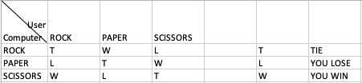

# vuejs-rpc-game

The game demo how you can create a rock paper scissors game. 
It is a DDD design pattern and it used the very basic framework - vuejs.
The element can be extends basic the feature that we expected.

## Project setup
```
npm install
```

### Compiles and hot-reloads for development
```
npm run serve
```

### Compiles and minifies for production
```
npm run build
```

### Run your unit tests
```
npm run test:unit
```

### Lints and fixes files
```
npm run lint
```

## This image show how the matrix arrays look like.


This image provide all the possible result for only rock-paper-scissors game. In order to extends the game with more different gestures(adding lizard Spock), the developer just need to analyst the news results. 
and add lizard Spock into matrix arrays . e.g. image below


